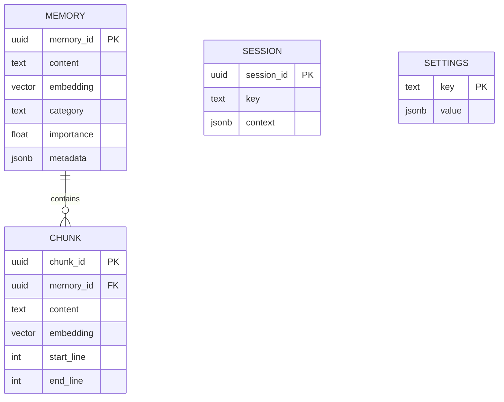

# pg_agent

> **Autonomous Agent Capabilities for PostgreSQL**

[](https://www.postgresql.org)
[](https://github.com/pgvector/pgvector)
[](LICENSE)

**pg_agent**는 **"Glass Box AI"** 를 실현하는 PostgreSQL Extension입니다. Agent의 메모리 시스템을 PostgreSQL 내부로 완벽하게 이식하여, 투명하고 제어 가능한 에이전트 메모리 시스템을 제공합니다.

---

## 📚 목차

1. [개요](#-overview)
2. [주요 기능](#-key-features)
3. [아키텍처](#-architecture)
4. [설치](#-installation)
5. [사용법](#-usage)
    - [SQL API](#sql-api)
    - [CLI Chat](#cli-chat)
    - [Web GUI](#web-gui)
6. [설정](#-configuration)
7. [API 레퍼런스](#-api-reference)

---

## 👁️ Overview

기존의 AI 에이전트 프레임워크들은 메모리를 블랙박스 형태의 Vector DB나 파일 시스템에 숨겨두었습니다. **pg_agent**는 모든 메모리와 결정 과정을 표준 SQL 테이블(`pg_agent.*`)에 투명하게 저장합니다.

- **투명성 (Transparency)**: SQL 쿼리로 언제든지 에이전트의 생각을 들여다볼 수 있습니다.
- **제어 가능성 (Control)**: DELETE, UPDATE 문으로 잘못된 기억을 수정하거나 삭제할 수 있습니다.
- **확장성 (Scalability)**: PostgreSQL의 강력한 인덱싱과 트랜잭션을 그대로 활용합니다.

---

## ✨ Key Features

### 1. Hybrid Search (Vector + Full-Text)
단순한 벡터 유사도 검색은 키워드 매칭(예: 고유명사)에 약합니다. pg_agent는 `pgvector`의 시맨틱 검색과 PostgreSQL의 `tsvector` Full-Text Search를 결합하여 최적의 결과를 제공합니다.
- **Vector Search (70%)**: 의미적 유사성 (Semantic)
- **Keyword Search (30%)**: 정확한 단어 매칭 (Lexical)

### 2. Auto-Capture System
대화 내용을 분석하여 중요한 정보만 자동으로 영구 기억으로 전환합니다.
- **User Preference**: "나는 다크모드를 좋아해" -> `preference` 태그로 저장
- **Decision**: "다음주에 회의하기로 결정했어" -> `decision` 태그로 저장
- **Fact**: "내 이메일은 test@example.com이야" -> `entity` 태그로 저장

### 3. Smart Chunking
긴 문서는 의미 단위로 자동 분할(Chunking)되어 저장됩니다. 각 청크는 원본 문서와 연결되며, 검색 시 해당 청크의 위치(Line Number)까지 추적 가능합니다.

### 4. Multi-Modal Interface
- **SQL API**: 개발자를 위한 Low-level 제어
- **CLI Chat**: 빠른 테스트와 디버깅을 위한 터미널 인터페이스
- **Web GUI**: 일반 사용자를 위한 시각적 메모리 관리 도구

---

## 🏗 Architecture

모든 데이터는 `pg_agent` 스키마 내에 저장됩니다.



---

## 🚀 Installation

### Prerequisites
- PostgreSQL 14+
- `pgvector` extension
- `pgcrypto` extension (기본 포함)

### 1. PostgreSQL Extension 설치

소스 코드에서 직접 빌드하거나 SQL 파일을 실행합니다.

```bash
# 방법 A: Makefile 사용 (권장)
cd pg_agent
make dev-install

# 방법 B: SQL 파일 직접 실행
psql -d postgres -c "CREATE EXTENSION vector;"
psql -d postgres -f pg_agent--0.1.0.sql
```

### 2. Python 환경 설정 (CLI/GUI용)

```bash
pip install -r requirements.txt

# 환경 변수 설정
cp .env.example .env
vi .env
# OPENAI_API_KEY=sk-... 등 입력
```

---

## 📖 Usage

### SQL API

가장 강력하고 유연한 방법입니다.

```sql
-- 1. 메모리 저장 (임베딩 자동 생성 아님, 클라이언트에서 주입 필요)
SELECT pg_agent.store(
    'User prefers dark mode interfaces', 
    '[0.01, -0.02, ...]'::vector
);

-- 2. 하이브리드 검색
SELECT content, score, category 
FROM pg_agent.search(
    'dark mode', 
    '[0.01, -0.02, ...]'::vector, 
    5
);

-- 3. 세션 컨텍스트 저장
SELECT pg_agent.session_set('user:123', '{"last_topic": "react"}'::jsonb);
```

### CLI Chat

터미널에서 에이전트와 대화하며 메모리 기능을 테스트합니다.

```bash
python cli/chat.py --db postgresql://localhost:5432/postgres
```

### Web GUI

브라우저에서 대화, 설정 변경, 메모리 관리를 수행합니다.

```bash
python gui/server.py --port 8000
```
- 접속: `http://localhost:8000`
- **Settings 탭**: 모델(OpenAI/Gemini 등) 변경 가능
- **Memory 탭**: 저장된 기억을 실시간으로 확인하고 삭제 가능

---

## ⚙️ Configuration

`pg_agent.settings` 테이블을 통해 시스템 동작을 제어합니다.

| Key | Default | Description |
|-----|---------|-------------|
| `embedding_provider` | `openai` | 임베딩 모델 제공자 (openai, gemini, voyage) |
| `embedding_model` | `text-embedding-3-small` | 사용할 임베딩 모델명 |
| `chat_provider` | `openai` | 채팅 모델 제공자 (openai, anthropic, gemini) |
| `chat_model` | `gpt-4o-mini` | 사용할 LLM 모델명 |
| `auto_capture` | `true` | 중요 대화 내용 자동 저장 여부 |
| `search_limit` | `5` | 검색 시 참조할 최대 메모리 개수 |
| `min_similarity` | `0.3` | 검색 최소 유사도 임계값 (0.0 ~ 1.0) |

**설정 변경 예시:**

```sql
-- 채팅 모델을 GPT-4o로 변경
SELECT pg_agent.set_setting('chat_model', '"gpt-4o"');

-- 자동 저장 끄기
SELECT pg_agent.set_setting('auto_capture', 'false');
```

---

## 📚 API Reference

### Core Functions

#### `pg_agent.store(content, embedding, source, importance)`
- **설명**: 메모리를 저장합니다. 중복 내용은 해시 기반으로 업데이트됩니다.
- **파라미터**:
  - `content`: 저장할 텍스트
  - `embedding`: 1536차원 벡터 (선택)
  - `source`: 출처 ('user', 'agent', 'system')
  - `importance`: 중요도 (0.0 ~ 1.0)
- **리턴**: `memory_id` (UUID)

#### `pg_agent.search(query, embedding, limit, vector_weight, text_weight)`
- **설명**: 하이브리드 검색을 수행합니다.
- **리턴**: `memory_id`, `content`, `score`, `category`

#### `pg_agent.store_document(content, chunk_embeddings, title)`
- **설명**: 긴 문서를 자동으로 청킹하여 저장합니다.
- **리턴**: 부모 `memory_id`

### Utility Functions

- `pg_agent.stats()`: 전체 메모리, 청크, 세션 수 통계 반환
- `pg_agent.session_get(key)`: 세션 컨텍스트 조회
- `pg_agent.reset_settings()`: 설정을 기본값으로 초기화

---

## License

GPL v3 - See [LICENSE](../../LICENSE)
